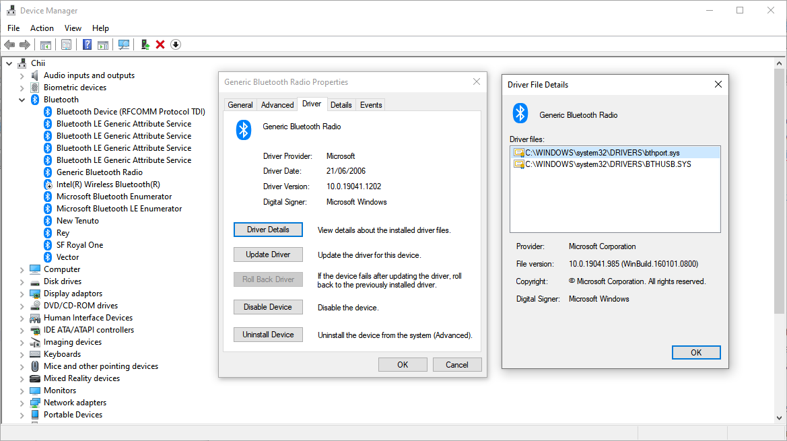
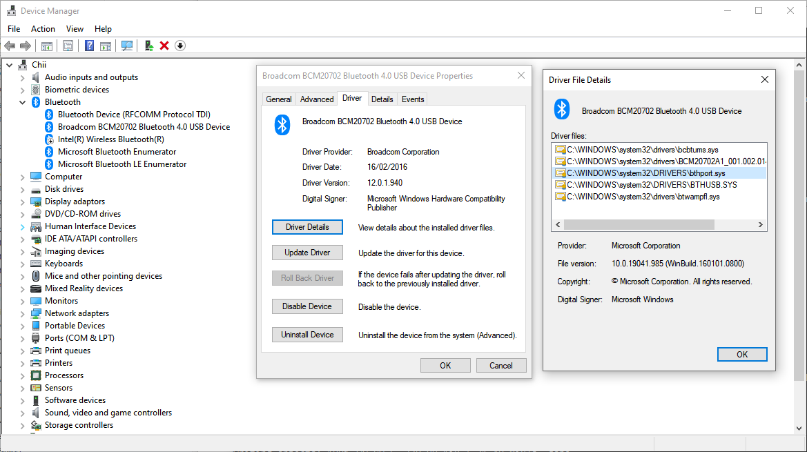
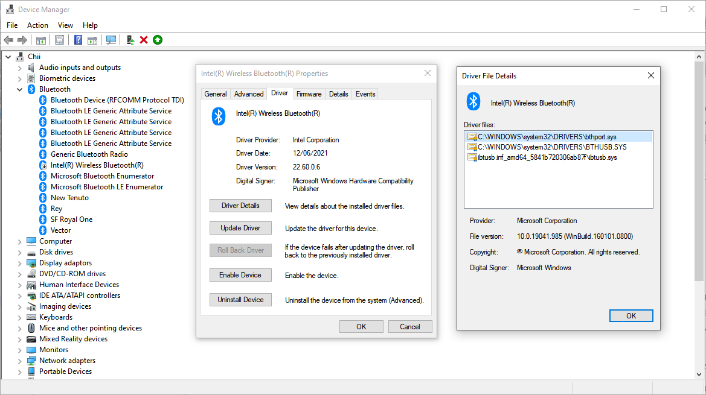
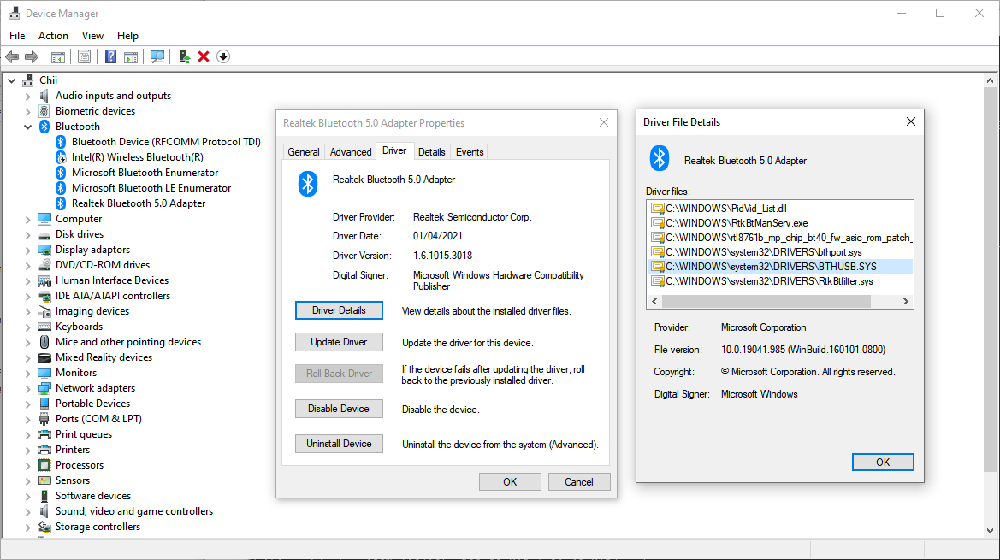

# General Bluetooth Device Questions

## What type Of Bluetooth dongle should I use?

You will need a Bluetooth 4 adapter of some kind. For Windows 10 and Linux desktops, we usually recommend the following adapter (Amazon links below, availability may differ in other countries):

[TP-Link UB400](https://www.amazon.com/TP-Link-Bluetooth-Supports-Keyboard-Controllers/dp/B08YFP44SJ)

This specific adapter is what our developers use to test the library. That said, most Bluetooth 4 dongles should work fine for most toys.

Other countries may have luck with searching "CSR 4.0 bluetooth dongle", as this is a commonly used chipset:
- [USB Bluetooth 4.0 Adapter, Techkey Bluetooth Dongle CSR 4.0 Bluetooth Empfänger Transmitter (Amazon Germany)](https://www.amazon.de/Techkey-Bluetooth-Computer-Skype-Anruf-unterst%C3%BCtzt/dp/B07QL7C6WG)
- [Onvian Bluetooth Adapter USB CSR 4.0 Dongle Receiver (Amazon Australia)](https://www.amazon.com.au/Onvian-Bluetooth-Receiver-Transfer-Wireless/dp/B077Z27FTS)

However, **some toys from [WeVibe](./wevibe.md) and [Satisfyer](./satisfyer.md)** require dongles with a specific brand of radio. The dongle above should work for them, but other dongles may not. For more info on these devices, see their brand specific sections of the FAQ.

## Will my on-board/motherboard Bluetooth radio work?

For **macOS** hardware newer than 2012, the on-board radio works well. For pre-2012 macOS hardware, the aforementioned dongle is recommended.

For **Windows and Linux** desktops and laptops, we do not recommend using on-board radios unless they have an external antenna. They usually have less broadcast range (**Note**: Radios that have an external antenna hooked up to them tend to work better, and may be exempt from this). We've also had many issues with the drivers that come with on-board Bluetooth radios not working with our software. If you are using a system with an on-board radio and are having issues, we recommend buying the dongle listed above.

## Can I use a Bluetooth 5 dongle?

Bluetooth 5 dongles and radios are considered unsupported at the moment across all platforms. While
some may work on some platforms, they're new enough that we cannot confirm they will work for
everyone, and they have been observed to sometimes cause intermittent scanning and connection
problems. We recommend all users use BT4 dongles for now.

## Is there any way I can improve my Bluetooth connection?

* Plugging dongles directly into towers/laptops can cause issues with line of sight and signal
  degradation. We recommend plugging dongles into either an external USB hub.
* Using a USB 2 hub may work better than using a USB 3 hub, as USB 3 hubs tend to emit EMI which can
  obscure the Bluetooth radio.
* If you are in a situation where you may be moving around a lot (i.e. VR, cam modeling, etc...),
  another possible solution is to put a Bluetooth USB dongle on the end of a USB extension cable,
  and place the dongle near you (or in cases where you're clothed, possibly in a pants pocket if
  available). This may alleviate disconnects and provide a more reliable connection.

In the end, remember: Radios are black magic, and there's only so much anyone can do here.

## When should I pair my device with my operating system?

You should **NOT NEED TO PAIR** your device with your operating system, unless specifically called out in a hardware brand page on the FAQ (for instance, [WeVibe](hardware/wevibe.md) or [Satisfyer](hardware/satisfyer.md)). Most Bluetooth LE connections are handled by Buttplug and do not require pairing.

## Can I use my phone as a Bluetooth device relay?

This is a possibility, but it depends on whether or not the application and hardware you're working
with support mobile platforms. At the moment, Buttplug only works on web for Android, and requires a
special browser for iOS. Native Android/iOS apps currently do not support Buttplug, though this may
change in the future.

Some toys, like Lovense, have special apps (like Lovense Connect) that allow users to use their
phone as the Bluetooth connection. If Buttplug/Intiface support this capability, it will be listed
here in the brand specific questions section.

## I connected my Bluetooth device to my phone, but my computer can't see it

If you connected your Bluetooth device to your phone before connecting it to your desktop, you may
have paired it with your phone, meaning your device will not talk to any other machines. You will
need to unpair the device with your phone before you try connecting it to your desktop via Intiface
or other apps.

Most (but not all) Bluetooth LE devices do not need to be paired with machines in order to talk to
them. However, some brands (like WeVibe and Kiiroo) do have hardware that requires pairing. If a
piece of hardware is required to pair, it will be called out here in the brand specific questions
section.

## I'm Running Win10 and have a working Bluetooth adapter but Intiface still can't see any devices

Some Bluetooth adapters come with drivers that are compatible with the older device system that's been present in Windows for much longer than the BLE/GATT support added in Win10 (which is what Buttplug/Intiface use to discover and connect to devices). Those older drivers will make the adapter look like it's working in some places but not in Buttplug/Intiface.

The most common offender is the CST driver, but there are Broadcom drivers that have this issue too.

Ideally, you'd have just plugged in the adapter and let Windows auto install the drivers, but that's not always the intuitive thing to do, especially when the packaging for the adapters often tell you to install their drivers. If you did install the vendor supplied drivers, first thing to try is uninstalling them (usually from `Apps and Features`) and then removing and replugging-in the adapter.

### How can I tell if I'm using the wrong driver?

Right-click on the Start/Windows button and select `Device Manager`. This'll show you a tree of all of your computer's hardware. Under the `Bluetooth` you should see a Bluetooth Adapter (the name may vary, as you can see in the the screenshots below); right click the the adapter and select `Properties`, then on the `Driver` tab click the `Driver Details` button. This should list multiple files, but the crucial ones you should expect to see are `bthport.sys` and `BTHUSB.SYS`.

