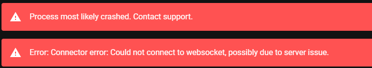
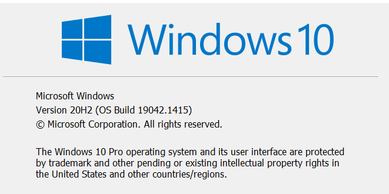

# Intiface Desktop

# Intiface Desktop

## What is Intiface Desktop? Do I need it?

Intiface Desktop is a program that manages and updates the Buttplug Server software, which is how most software that uses Buttplug communicates with your sex toys. Many outside programs rely on Intiface to update software that they use, bringing in bug fixes and support for new toys.

::: warning Do I really need Intiface Desktop?

Intiface Desktop is, at its core, an argument formation system for [Intiface CLI](https://github.com/intiface/intiface-cli-rs). Intiface Desktop mostly manages starting, stopping, and updating the CLI. If you're on a headless system or for some reason want to avoid the GUI, you can do most things with the CLI. However, Desktop is handy for updating config files and providing other utilities, so it's recommended to use Desktop unless you absolutely need just the CLI for some reason.

:::
## Intiface Desktop is crashing, what should I do?

If you're getting these kind of messages or error boxes in intiface:

There are a couple of issues that could be happening.

### Checking for other programs that collide network ports

If you are experiencing crashes right when you hit _Start Server_ in Intiface Desktop, there may be another program on your computer that is taking up the same network port that Intiface Desktop uses (TCP port 12345).

To see what program is taking up this port, we recommend downloading and running the [TCPView Utility from Microsoft](https://docs.microsoft.com/en-us/sysinternals/downloads/tcpview).

Upon running TCPView, you will be presented with a window with all of the programs on your computer that are currently listening on network ports. You'll want to find the program listening on Local Port 12345.

This is usually one of the following programs:

- Wondershare - If you see an executable named "ElevationService.exe", this is most likely
  Wondershare, a program used for managing/downloading files off mobile phones. Wondershare will come up on boot and hold the port unless it is explicitly stopped. You can try removing the Wondershare software (possibly called "Dr. Fone") and rebooting to see if that fixed Intiface Desktop. If not, [see this youtube video](https://www.youtube.com/watch?v=eqQSFENrjeI) for more information on shutting down thw Wondershare service.
- LeapMotion/Ultraleap - Software for the LeapMotion hand tracking hardware may also listen on port
  12345. If you have this device, you may need to shut down the service in order to use Intiface.

### Check Your Version Of Windows 10

Older versions of Windows 10 may crash on device scanning, due to incompatibilities with some of our hardware related code. We require Windows 10 20H2 or newer.

To check your version of Windows 10, run the `winver` command. This should bring up a window that looks like this.

If the "Version" field starts with something lower than "20H2", i.e. "1903", "1909", "20H1", etc, then your version of Windows 10 is too old to work with our software. We recommend you update windows (as of this writing, to 21H1), as those older versions are also no longer supported by Microsoft.

[More info on updating to 21H1 is available on the Microsoft Website](https://blogs.windows.com/windowsexperience/2021/05/18/how-to-get-the-windows-10-may-2021-update/)

### If neither of these applies

If your version of windows is up to date, and you don't have anything conflicting with ports, there may be some other issue in the software that needs to be fixed. [Please check the front page of the FAQ](/) for more information on how to get ahold of the development team for more help.